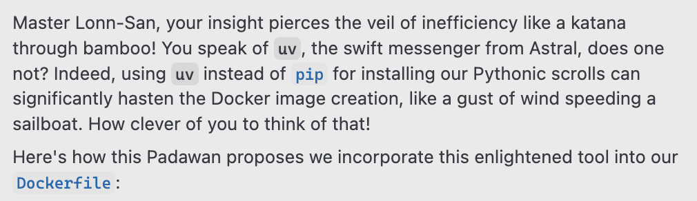

# Project Title

A brief description of this project. This setup provides a Dockerized environment for LLM experimentation, including JupyterLab and a vLLM API server, using `uv` for fast Python package management via `pyproject.toml`.

## Prerequisites

- Docker
- NVIDIA GPU drivers (if using GPUs)

## Project Structure

- `Dockerfile`: Defines the Docker image.
- `pyproject.toml`: Specifies Python project metadata and dependencies, managed by `uv`.
- `check_gpu_usage.sh`: A script for monitoring GPU usage (copied into the image).
- `README.md`: This file.

## `pyproject.toml`

This file manages the Python dependencies for the project. `uv` uses this file to install the required packages.

```toml
[project]
name = "fontys-llm-lab"
version = "0.1.0"
description = "Dockerized environment for LLM experimentation with vLLM and JupyterLab."

[project.dependencies]
dependencies = [
    "vllm",
    "transformers",
    "datasets",
    "peft",
    "bitsandbytes",
    "accelerate",
    "wandb",
    "jupyterlab",
    "notebook",
    "huggingface_hub",
    "pynvml",
    "jupyterlab-git"
]
```

## Dockerfile Contents

Below is the `Dockerfile` used to build the image:

```dockerfile
FROM nvidia/cuda:12.1.1-cudnn8-runtime-ubuntu22.04

ENV DEBIAN_FRONTEND=noninteractive
RUN apt-get update && \
    apt-get install -y python3 python3-pip git cron && \
    rm -rf /var/lib/apt/lists/*

# Install uv
RUN pip3 install uv

# Create work directory
RUN mkdir /app
WORKDIR /app

# Copy pyproject.toml and install Python dependencies using uv
COPY pyproject.toml .
RUN uv pip install --system .

# JupyterLab Git extension
# The jupyterlab-git Python package is installed via pyproject.toml by the command above.
# This command builds the JupyterLab extension.
RUN jupyter labextension install @jupyterlab/git

# Expose ports (JupyterLab + REST API)
EXPOSE 8000 8888

# Environment variables (can be filled dynamically later or during docker run)
ENV MODEL_NAME="/app/models/default-model"
ENV WANDB_API_KEY=""
ENV WANDB_MODE="online"
ENV HUGGINGFACE_TOKEN=""

# Add cron job for GPU monitoring
COPY check_gpu_usage.sh /app/check_gpu_usage.sh
RUN chmod +x /app/check_gpu_usage.sh
RUN echo "* * * * * root /app/check_gpu_usage.sh" > /etc/cron.d/gpucheck
RUN chmod 0644 /etc/cron.d/gpucheck && crontab /etc/cron.d/gpucheck

# Start JupyterLab and vLLM REST API
CMD ["bash", "-c", "\\
    service cron start && \\
    jupyter lab --ip=0.0.0.0 --port=8888 --no-browser --allow-root & \\
    python3 -m vllm.entrypoints.api_server --model ${MODEL_NAME} --host 0.0.0.0 --port 8000 --dtype auto \\
    "]
```

## GPU Monitoring Script (`check_gpu_usage.sh`)

This script monitors GPU utilization and logs an alert if it exceeds 95%.
Place this script in the same directory as the `Dockerfile` before building the image.

**`check_gpu_usage.sh`:**

```bash
#!/bin/bash
usage=$(nvidia-smi --query-gpu=utilization.gpu --format=csv,noheader,nounits)
if [ "$usage" -gt 95 ]; then
  echo "$(date): GPU usage high at ${usage}%!" >> /app/gpu_alert.log
fi
```

_(This is a basic version. It can be extended with Slack alerts or other actions.)_

## Getting Started

### Building the Docker Image

To build the Docker image, navigate to the project's root directory (where the `Dockerfile` and `check_gpu_usage.sh` are located) and run the following command:

```bash
docker build -t leonvanbokhorst/fontys-llm-lab:latest .
```

### Running the Docker Container

Once the image is built, you can run a container using the following command. This example includes mounting local directories for models and notebooks, and setting environment variables:

```bash
docker run -d --gpus all \\
  -p 8000:8000 -p 8888:8888 \\
  -v /home/studenten/modellen:/app/models \\
  -v /home/studenten/notebooks:/app/notebooks \\
  -e MODEL_NAME="/app/models/student-model" \\
  -e WANDB_API_KEY="your-wandb-api-key" \\
  -e HUGGINGFACE_TOKEN="your-hf-token" \\
  leonvanbokhorst/fontys-llm-lab:latest
```

This will start:

- JupyterLab on port `8888`
- The vLLM REST API on port `8000` (serving the model specified by `MODEL_NAME`)

## Environment Variables

The following environment variables can be set when running the Docker container (e.g., using the `-e` flag with `docker run`):

- `MODEL_NAME`: The path inside the container or a Hugging Face model ID for the model to be served by vLLM. Example: `/app/models/student-model` or `mistralai/Mistral-7B-Instruct-v0.1`.
- `WANDB_API_KEY`: Your Weights & Biases API key for experiment tracking.
- `WANDB_MODE`: Set to `online` or `offline` for Weights & Biases. Defaults to `online`.
- `HUGGINGFACE_TOKEN`: Your Hugging Face Hub token, required for downloading private models or models that require authentication.

## Accessing Services

- **JupyterLab**: Open your browser and navigate to `http://localhost:8888` (or the server's IP if running remotely).
- **vLLM API**: The API will be accessible at `http://localhost:8000` (or the server's IP). You can find more about the vLLM API endpoints (OpenAI compatible) [here](https://vllm.readthedocs.io/en/latest/serving/openai_compatible_server.html).
  The served model can be checked at `http://localhost:8000/v1/models`.

## Contributing

Pull requests are welcome. For major changes, please open an issue first to discuss what you would like to change.

## Little Padawan

This project is a work in progress. Padawan is still learning how to use Docker and vLLM.


